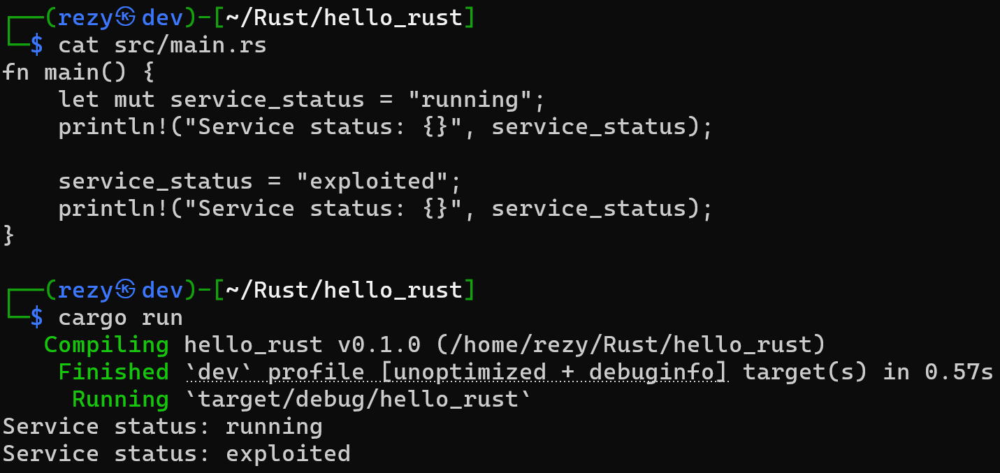
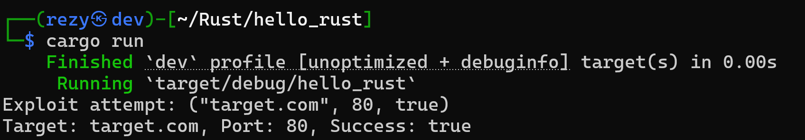
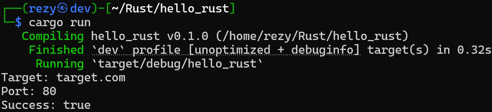

Welcome back to my Rust series! Today, we're exploring some key concepts: **data types and variables**. Whether you're working with data during a pentest or creating a custom tool, knowing how Rust manages these basics is crucial.

## **Types**

In Rust, every value has a specific type, and understanding these types is crucial, especially when handling different data structures. Rust is a statically typed language, which means that all variable types are known at compile time. This feature helps in catching bugs early, something we all appreciate during a lengthy pentest engagement.

Here’s a quick overview of some basic types:

* **Integers**: For when you need to count something (`u8`, `i32`, `u64`, etc.).
    
* **Floating-Point Numbers**: Perfect for dealing with calculations that require precision, like timing the response of a server (`f32`, `f64`).
    
* **Booleans**: True or False, often used in condition checks (`bool`).
    
* **Characters**: Represents a single character (`char`).
    
* **Tuples**: Group multiple values of different types into one compound type.
    
* **Arrays**: Fixed-size collection of elements, all of the same type. Ideal for holding things like a list of common passwords or IP addresses.
    

**Example**:

```rust
let ip_addresses: [u8; 4] = [192, 168, 1, 1];
let port_number: u16 = 8080;
let is_open: bool = true;
```

Here, `ip_addresses` is an array of four `u8` elements representing an IPv4 address. The `port_number` is stored as a `u16` integer, and `is_open` is a boolean that might represent the state of a port after a scan.

<div data-node-type="callout">
<div data-node-type="callout-emoji">💡</div>
<div data-node-type="callout-text">In Rust, numeric types like <code>u8</code>, <code>i8</code>, <code>i32</code>, and <code>f32</code> represent specific kinds of integers and floating-point numbers. The <code>u8</code> type is an unsigned 8-bit integer, meaning it can store values from 0 to 255, while <code>i8</code> is a signed 8-bit integer that can hold values from -128 to 127. Moving to larger sizes, <code>i32</code> is a signed 32-bit integer, capable of storing numbers from -2,147,483,648 to 2,147,483,647. For floating-point numbers, <code>f32</code> is a 32-bit floating-point type, used to represent decimal numbers with single precision.</div>
</div>

## **Type Inference**

Rust is smart. It often knows the type of a variable without you explicitly telling it. This is called type inference. While Rust’s compiler is very good at figuring out the type, there are times when you need to be explicit, especially when dealing with more complex types or when you want to avoid ambiguity.

For example:

```rust
let response_time = 120.5; // concluded as f64
let host = "10.0.0.1"; // concluded as &str
```

Rust concludes that `response_time` is an `f64` and `host` is a string slice (`&str`). This saves time and keeps the code clean.

<div data-node-type="callout">
<div data-node-type="callout-emoji">💡</div>
<div data-node-type="callout-text">A string slice (<code>&amp;str</code>) is a reference to a part of a string, typically a sequence of characters stored in memory. Unlike <code>String</code>, which is a heap-allocated, growable string, a string slice is an immutable reference to a portion of a string. We will get back to this in upcoming articles so don't worry.</div>
</div>

## **Mutability**

In Rust, **variables are immutable by default**. This is great for security since it prevents accidental modification of data. But, sometimes you need to change the value of a variable, like when updating the status of a service after an exploit. In such cases, you can declare the variable as mutable using the `mut` keyword.

Example:

```rust
let mut service_status = "running";
println!("Service status: {}", service_status);

service_status = "exploited";
println!("Service status: {}", service_status);
```



<div data-node-type="callout">
<div data-node-type="callout-emoji">💡</div>
<div data-node-type="callout-text">Remember, Rust needs a <code>main</code> function to execute code. However, in the examples, I might not use the <code>main</code> function, so please understand what to add to make it run.</div>
</div>

In this case, `service_status` starts as `"running"` but is later updated to `"exploited"`. By marking the variable as `mut`, Rust allows this change.

## **Constants and** `static` Variables

When you know a value won't change throughout the lifecycle of your program, you use a constant. Constants are declared using the `const` keyword and must always be typed.

```rust
const MAX_ATTEMPTS: u8 = 5;
```

Here, `MAX_ATTEMPTS` might represent the number of times you’ll attempt a brute-force attack before moving on.

Rust also has `static` variables, which are similar to constants but are static items with a fixed address in memory. They can hold references, and unlike constants, they can be mutable (though mutable `static` variables are not recommended due to potential data races).

```rust
static TIMEOUT: u64 = 3000;
```

In this example, `TIMEOUT` could represent a global timeout value used throughout your application.

## **Strings**

Working with text is something we often do in pentesting, whether it's manipulating payloads, parsing responses, or logging results. Rust provides two main string types: `String` and `&str`.

* `String`: A heap-allocated, growable string. Use this when you need to own and manipulate the string.
    
* `&str`: A string slice, which is a reference to a part of a `String`. It’s useful for passing strings around without needing to own them.
    

**Example**:

```rust
let payload = String::from("GET / HTTP/1.1\r\nHost: raunak.xyz\r\n\r\n");
let host = &payload[16..26]; // "raunak.xyz"
```

Here, `payload` is a `String` that holds an HTTP request, and `host` is a `&str` that slices a part of the `payload`.

## **Printing with Display and Debug**

When it comes to outputting data, Rust provides two main formatting traits: `Display` and `Debug`.

* `Display`: Used for user-facing output, typically meant to be more readable.
    
* `Debug`: Used for developer-facing output, often more detailed and suitable for debugging.
    

Let’s say we’re printing out the result of an exploitation attempt:

```rust
let exploit_result = ("target.com", 80, true);
println!("Exploit attempt: {:?}", exploit_result); // Debug
println!("Target: {}, Port: {}, Success: {}", exploit_result.0, exploit_result.1, exploit_result.2); // Display
```



Using `{:?}`, we can print a tuple with `Debug` formatting, and using `{}`, we can print individual components with `Display` formatting.

## **More about Printing**

Rust also supports more complex formatting through macros like `format!`, `print!`, and `println!`.

```rust
let exploit_result = ("target.com", 80, true);
let report = format!("Target: {}\nPort: {}\nSuccess: {}", exploit_result.0, exploit_result.1, exploit_result.2);
println!("{}", report);
```



Here, `format!` creates a formatted string that we can then print or log.

## Conclusion

Mastering data types and variables in Rust is key to writing efficient, secure, and strong code. By using Rust’s type system and mutability features, you can manage different data situations accurately and safely.

## Further Reading

* [The Rust Programming Language - Data Types](https://doc.rust-lang.org/book/ch03-02-data-types.html)
    
* [Rust By Example - Variables](https://doc.rust-lang.org/rust-by-example/variable_bindings.html)
    
* [Rust Reference - Variables and Types](https://doc.rust-lang.org/reference/variables.html)
    
* [Rust Language - Constants and Static Variables](https://doc.rust-lang.org/book/ch03-01-variables-and-mutability.html)
    
* [Rust Documentation - Formatting](https://doc.rust-lang.org/std/fmt/)