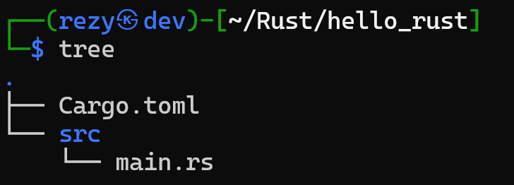
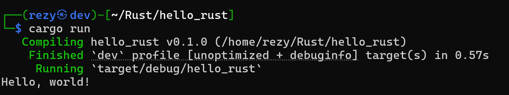

Hey there! I'm really pumped to take you on a journey into the world of Rust today. We're going to write our very first Rust program, and I'll explain some key concepts along the way to help you feel like a pro. Let's dive in!

## Cargo: The Build System and Package Manager

Before we start coding, let's talk about **Cargo**. Think of Cargo as your best friend in Rust. It's the official build system and package manager for Rust, and it's a game-changer. With Cargo, you can easily manage your projects, handle dependencies, run tests, and even build documentation—all from the command line.

Cargo makes compiling and managing a Rust project much simpler. Instead of manually compiling your code with `rustc`, Cargo does it for you. It's like having a tool that automates boring tasks, letting you focus on the fun parts.

So, why use Cargo instead of `rustc` directly? While `rustc` is good for compiling individual files, Cargo is designed for managing whole projects. It helps you keep track of dependencies, ensures your project is built consistently, and makes it easy to share your code with others. In short, Cargo makes life easier, just like how tools like `metasploit` or `nmap` make finding vulnerabilities simpler.

## Creating a New Rust Project with Cargo

Now, let’s create our first Rust project using Cargo. Open up your terminal and type:

```bash
cargo new hello_rust
```

This command creates a new directory called `hello_rust` with some files and folders inside. But what exactly did Cargo set up for us?

When you create a project with Cargo, it generates a directory structure that looks something like this:



* **Cargo.toml**: This is the configuration file for your project. It’s written in TOML (Tom’s Obvious, Minimal Language). Here, you can specify your project’s name, version, dependencies, and other metadata. It's like the `settings.py` in a Django project or `package.json` in a Node.js project.
    
* **src/**: This directory contains all your Rust source files. By default, Cargo creates a `main.rs` file here, which is the entry point of your Rust application.
    

Cargo also keeps track of a `cargo.lock` file (once you start adding dependencies). This file ensures that everyone who builds your project uses the exact same versions of your dependencies, maintaining consistency—a crucial aspect in software development.

## Writing Your First Rust Program

Alright, enough with the theory—let's write some code! Open the `main.rs` file inside the `src/` directory. You’ll see something like this:

```rust
fn main() {
    println!("Hello, world!");
}
```

This simple program prints "Hello, world!" to the console. It's a classic starting point in almost every programming language, and Rust is no exception.

## Printing in Rust

The `println!` macro is Rust’s way of printing text to the console. Notice the exclamation mark `!`—this indicates that `println!` is a macro, not a regular function. Macros in Rust are powerful tools that allow you to write code that writes other code, which can be incredibly useful in many situations. For now, just remember that `println!` is your go-to for outputting text.

To run your program, simply type:

```bash
cargo run
```

Cargo will compile your code and execute the resulting binary. You should see "Hello, world!" printed on your terminal.



## Comments: Documenting Your Code

Now that we've got our program running, let’s talk about comments. As a pentester, I can't stress enough how important it is to document your work. Whether you're writing a pentest report or coding, clear documentation is key.

Rust supports two main types of comments:

* **Single-line comments**: These start with `//` and extend to the end of the line.
    
    ```rust
    // This is a single-line comment
    ```
    
* **Multi-line comments**: These are enclosed in `/* */` and can span multiple lines.
    
    ```rust
    /*
    This is a multi-line comment.
    Useful for longer explanations or disabling blocks of code.
    */
    ```
    

Rust also supports **documentation comments**, which are a special kind of comment used to generate external documentation. Documentation comments (`///` for single lines and `/** */` for multiple lines) are used to create **API documentation** for your code. This is similar to how you might write comments in other languages to explain what a piece of code does, but in Rust, these comments can be automatically compiled into rich, formatted documentation.

```rust
/// This function prints a greeting to the console.
fn greet() {
    println!("Hello, world!");
}
```

Commenting your code is crucial because it helps others (and your future self) understand what’s happening in your code. It's like leaving breadcrumbs during a pentest to trace your steps or providing detailed explanations in a report.

## Conclusion

And there you have it—your first Rust program! We've covered a lot of ground today, from understanding Cargo and its directory structure to writing and running a simple "Hello, world!" program. We also touched on the importance of comments and documentation in code.

As we continue our Rust journey, we'll dive deeper into more complex topics, but for now, enjoy the satisfaction of seeing that "Hello, world!" printed on your screen. Rust is a powerful language with a lot to offer, and I can’t wait to explore more of it with you.

Happy coding, and keep documenting!